## To Iterate,Human; to Recurse, Divine.
### To understand what recursion is, you must first understand recursion.

#### 这是你需要看的最后一篇有关递归的文章，如果不是，请再看一遍

- 从故事说起
    1. 从前有座山
    2. 山里有座庙
    3. 庙里有个老和尚讲故事，他说
    4. 返回1

关于递归，你只需要记住**2**句话。是的，仅仅**2**句话，记住它们，你便成功掌握了递归的真谛。
### 不要人肉递归，不要人肉递归，不要人肉递归！
### 关注宏观语义，关注宏观语义，关注宏观语义！

为什么呢？

- 人脑真的不适合递归。是的，如此聪明复杂的大脑，真的不适合递归。我们天生短期记忆力差，没有办法凭脑子记住每一次向下的状态。
相反，人脑往往偏爱暴力。即便是用纸笔画出来，像剥洋葱一样往下剥，往往也会泪流满面。
- 设计一个递归函数，非常有套路，而且往往很短，并不难。但是一旦我们想把整个递归在脑子里跑一遍，便失控了。所以不要扎进深深的递归当中，
从宏观语义来理解，往往是更好的更有效的选择。

那么该如何理解递归呢？
- 递归本质上干了什么事？很简单，它将原来的问题，转化为 **同一个更小的问题**

仅仅从这一句话出发，我们尝试写出递归函数。
1. “更小的问题”
   - 这说明在调用递归函数的时候，我们的问题规模应该不断缩小
2. 问题的规模是有限的，每次都不断的缩小规模那么极限状态下是什么？
    - 必然有一个最小的问题。而这个问题往往很容易解决。一旦解决了这个问题，就可以终止了。然后一路解决比他大一点，更大一点，直到所有的问题。
    这有点像一串鞭炮，只需要点燃最前面的一个，然后就可以跑了。我们知道这会引发连锁反应，直到点燃所有的鞭炮
3. 一定不能忘记，我们定义的函数，它的宏观语义是什么，它究竟解决了一个什么问题
    
### 举个例子
#### 编写一个递归函数`fn(n)`,它接受一个正整数`n`，返回`n`的阶乘。
按照上述的思路，一步一步来
1. 这个函数的宏观语义是什么？它解决了什么问题？
    - 它用来计算传入参数`n`的阶乘
2. 计算`n`的阶乘，怎么转化为一个更小的问题？
    - 只需要`n` * `n-1`的阶乘
    - n-1的阶乘我怎么知道？很简单，不是刚刚定义了一个函数吗，它的语义就是计算传入整数的阶乘。即`fn(n-1)`
3. 这个问题最小的情况是什么？
    - 这个很简单，1的阶乘就是1.
    
综上，把这几个步骤翻译成代码：
```
    def fn(n):
        if n == 1:
            return 1
        return n * fn(n-1)
```

再来一个的例子
#### https://leetcode-cn.com/problems/remove-linked-list-elements/
删除链表中等于给定值 val 的所有节点。

还是相同的步骤
先来看图
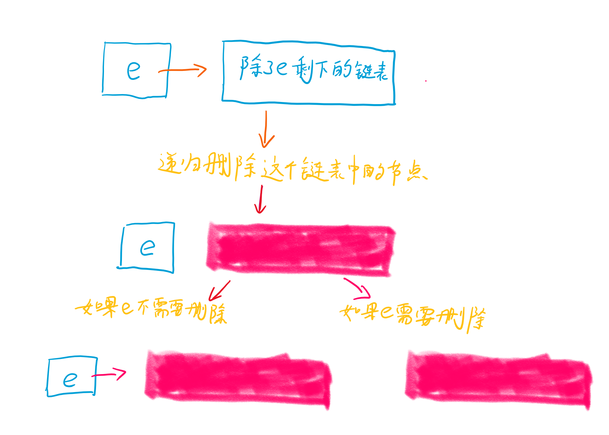
1. 定义一个函数，`removeElements(head, val):` 它的语义是删除以head为头节点的链表中，值为val的节点，并返回
2. 怎么转化为一个更小的问题？
    - 可以把链表理解为`head -> next`, 这样就分成了2部分，`head`，还有剩余的链表
    - 返回的时候仅需要判断，`head`本身是否就是`val`，如果是，则仅返回剩余的部分
3. 最小的问题是什么呢？
    - 当`head`为空，那就直接返回空
    
始终记住，`removeElements(head, val):`就是删除以head为头节点的链表中，值为val的节点，并返回
然后翻译上述步骤
```
def removeElements(self, head, val):
        """
        :type head: ListNode
        :type val: int
        :rtype: ListNode
        """
        if not head:
            return
        head.next = self.removeElements(head.next, val)
        return head.next if head.val == val else head
```

### 还是不明白？
也许你还是纠结，递归的运行机理是什么，刚刚的删除链表中值为val的节点，我一点也没看出来哪里做了“删除”的操作呀？

递归的微观机理，还是画出来吧。注意，还是不建议人肉递归。仅仅画出运行的示意原理。

首先，将代码划分为3块

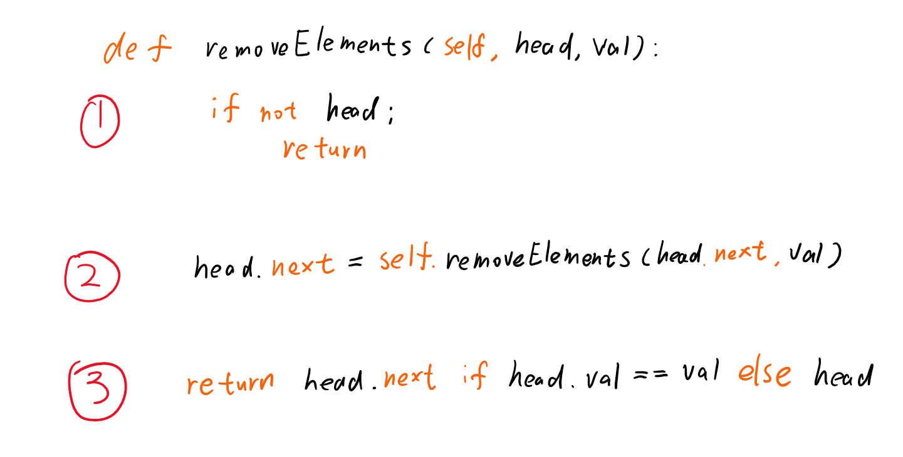

假设我们需要在链表` 5->6->7->null` 中删除6

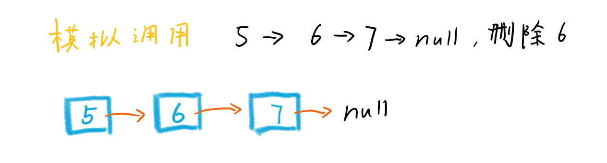

先执行`（1）`

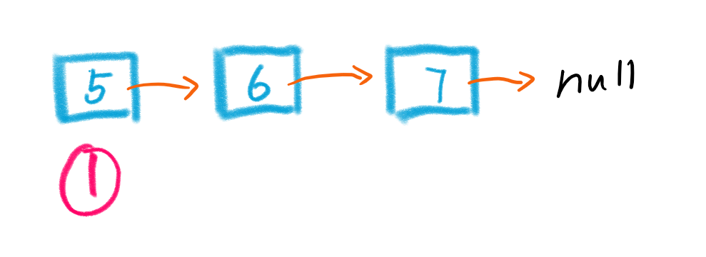

判断不为空，于是执行`(2)`

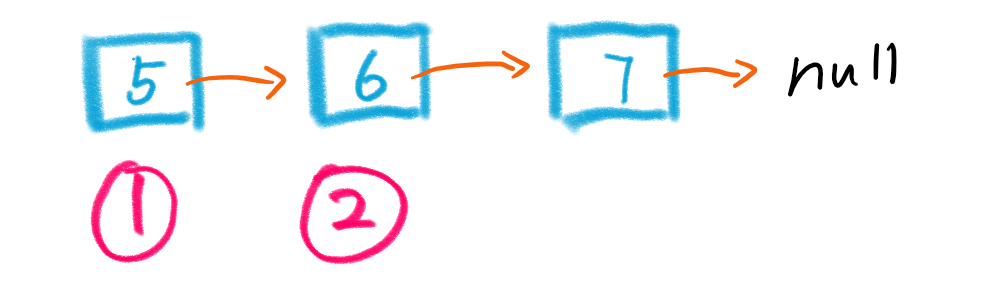

`(2)` 这一步的效果便是，`5`的`next`指向`（2）`执行的结果，但是结果是什么呢？

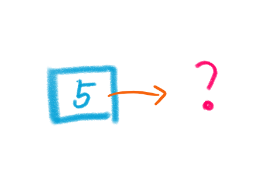

先不着急，往下递归

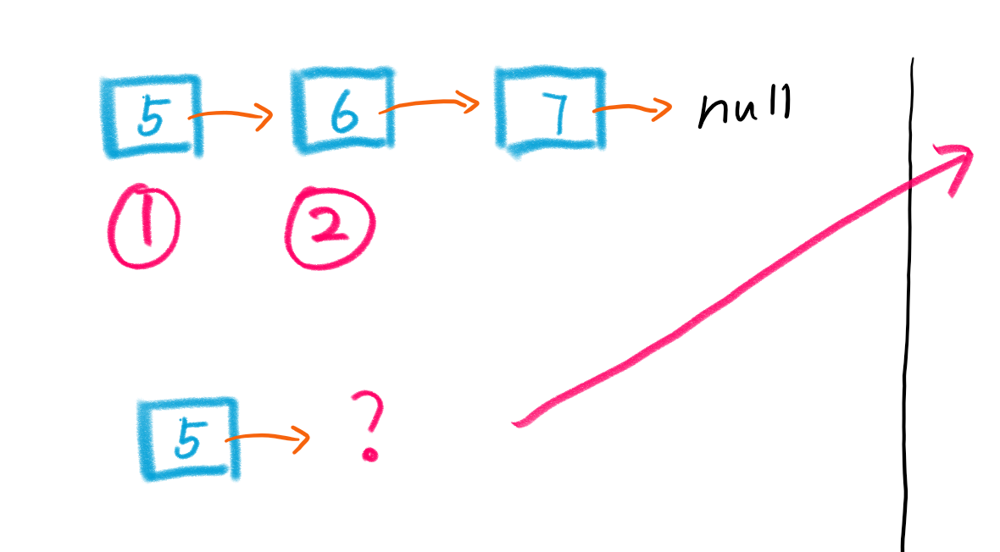

对于5的next，同样在这个函数中处理

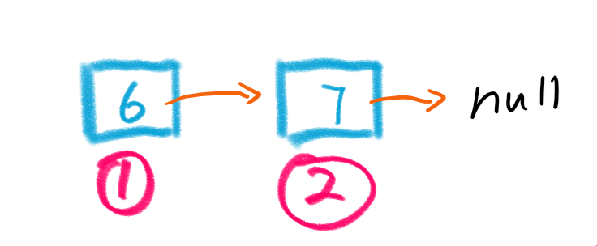

这时又遇到了之前的问题，6的next是啥？

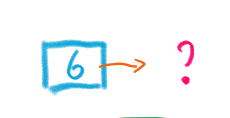

继续往下递归

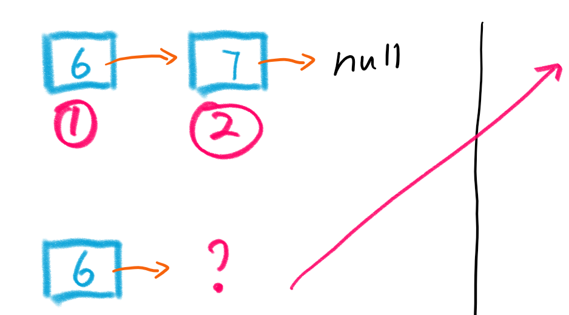

依旧重复之前的问题

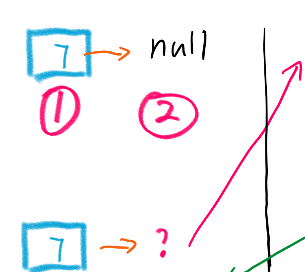

最后，我们来到了最小的问题

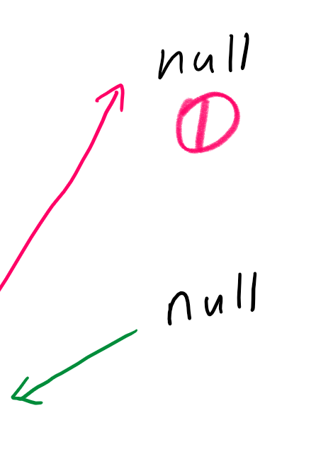

这里我们只执行到`1`，便`return`了.这样一来，上次调用的结果便有了答案

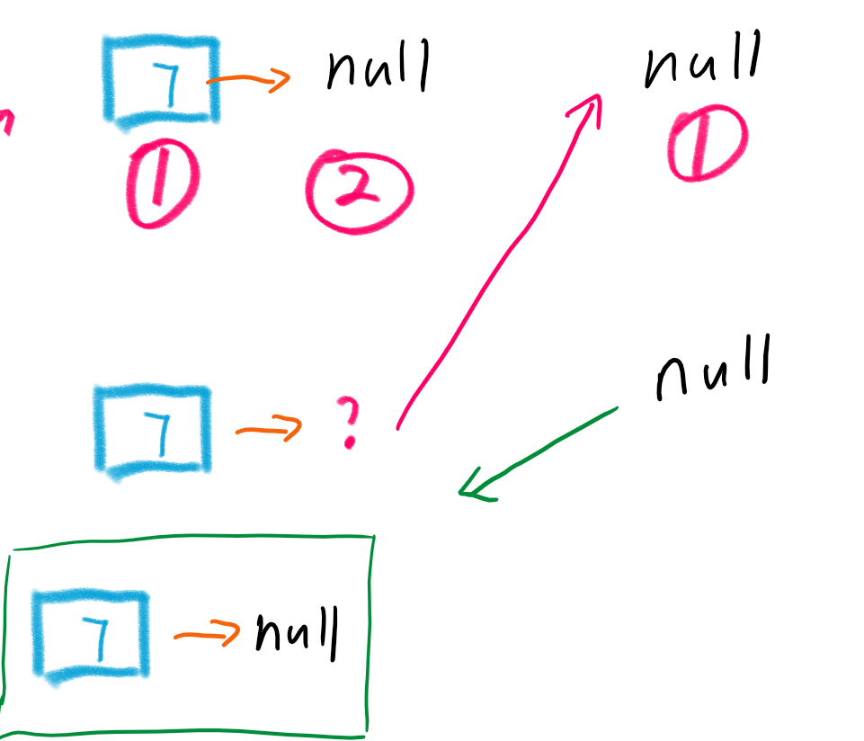

然后还没完，继续执行`3`.`7!=6`,所以返回整个链表

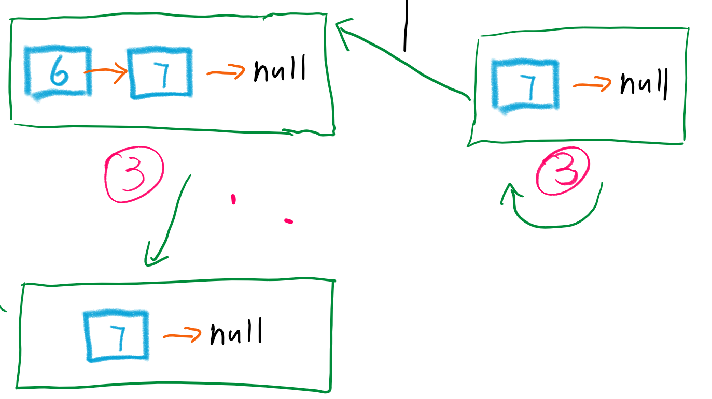

这一层的整个过程如下

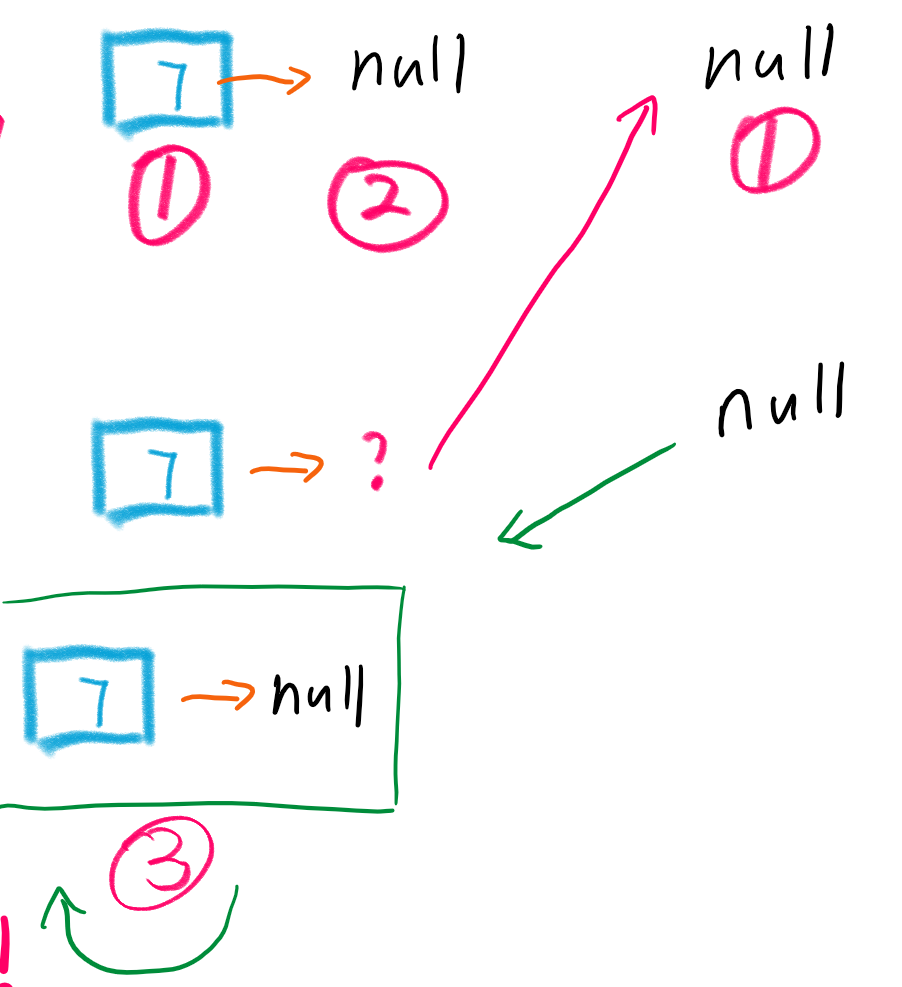

还在苦苦等待结果的6这个节点，终于收到了回复


注意，这里运行`3`，返回的就是 `7-> null`了，因为`6`与待删除的节点相等，于是返回了`6.next`

同理，剩下的不步骤应该可以自己想出来了吧

整个流程

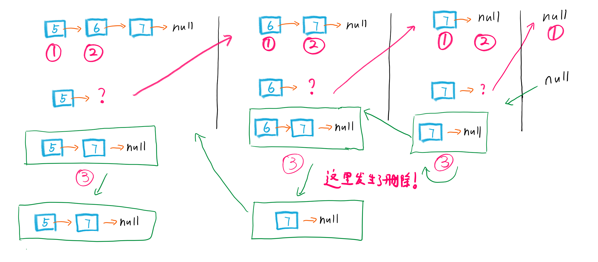


这样一来，递归运行的微观机制，就了解了

### 未完。递归树，时间复杂度分析，优化，记忆化递归。。。
